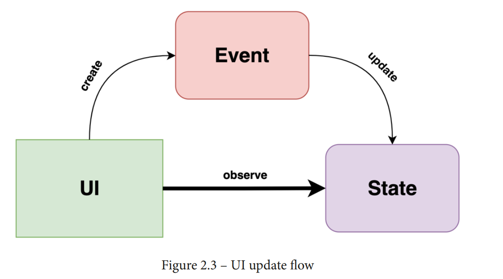

### 1. ViewModel

> ViewModel oversees what data is sent back to the UI controllers and how the UI state reacts to user-generated events. That's why we can call ViewModel as a master of the UI controller – since it represents the authority that performs decision-making for UI-related events

- Hold, manage, and preserve the entire UI state.
- Request data or reload content from the server or other sources
- Prepare data to be displayed by applying various transformations (such as map,sort, filter, and so on)
- Accept user interaction events and change the state based on those events.

### 2. Why do you need ViewModels?

> ViewModel should not have a reference to a UI controller and should run independently of it.This reduces coupling between the UI layer and ViewModel and allows multiple UI components to reuse the same ViewModel.

### 3. Android Jetpack ViewModel

> #### Important note
>
> When the ViewModel is used in Compose, it lives by default for as long as the parent Fragment or Activity does. For the ViewModel to live as long as a top-level composable (or screen composable) function does, as shown in the previous diagram, the composable must be used in conjunction with a navigation library. More granular composables can have smaller lifetimes.

> Optionally, if you need to pass parameters whose values are decided at runtime to your ViewModel, you can create and pass a ViewModelFactory instance to the viewModel() constructor. ViewModelFactory is a special class that allows you to control the way your ViewModel is instantiated

> From this point on, on certain older Compose versions, the Compose Preview functionality might not work as expected anymore. As the RestaurantsScreen composable now depends on a RestaurantsViewModel object, Compose can fail to infer the data that is passed to the previewed composable, thereby not being able to show us the content

### 4. Defining and handling state with Compose

- State represents a possible form of the UI at a certain point in time. This form can change or mutate. When the user interacts with the UI, an event is created that triggers a change
  in the state of the UI.
- An event is represented by different interactions that are initiated by the user that target the app and that consequently cause its state to update

> When defining state objects in Compose, you can replace the assignment (=) operator with property delegation, which can be achieved with the by operator: val favoriteState by remember { … }. By doing this, you will not need to use the .value accessor anymore as it is delegated.

> When we're saving state-related data, it's crucial to save lightweight objects that
> define the state and not the entire data that is described on the screen. For large
> data, we should use local persistence

### 5. Further reading

1. Exploring ViewModel with runtime-provided arguments
   * https://developer.android.com/codelabs/kotlin-androidtraining-view-model#7.
2. Exploring ViewModel for Kotlin Multiplatform projects
   * https://github.com/dbaroncelli/D-KMP-sample
3. Understanding how to minimize the number of recompositions
   * https://developer.android.com/jetpack/compose/lifecycle?hl=bn-IN&skip_cache=true#skipping
