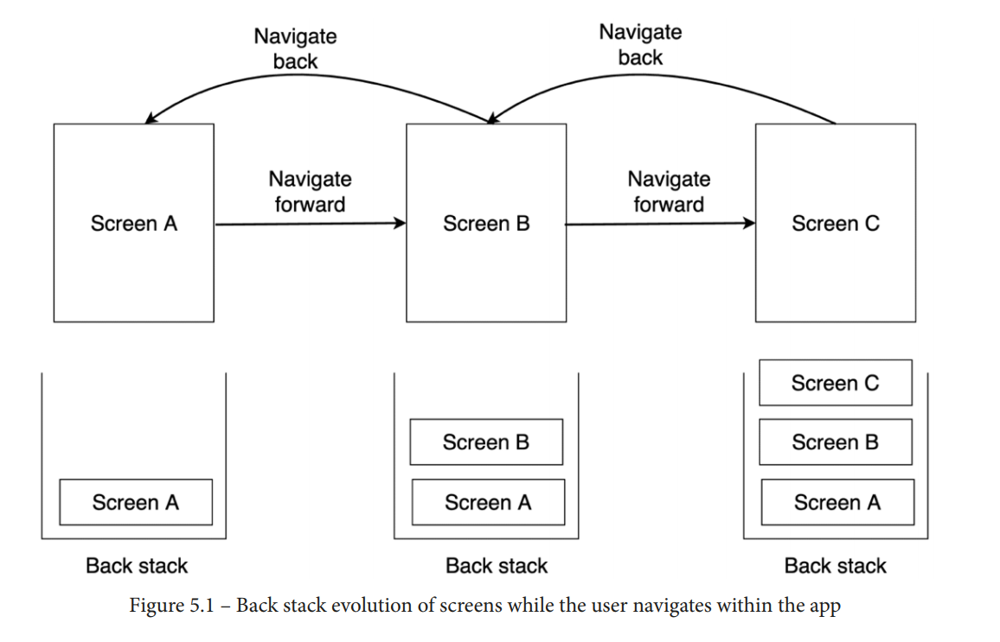

### 1. Jet pack navigation component

> Initially, the Navigation component specialized in offering navigation mainly
> between Fragment components. Today, the library also supports Compose
> and the navigation between composable functions.

* **Navigation graph**: The core source of information related to navigation within your
  app. In the navigation graph, you define all the destinations as well as the possible
  paths that the user can take throughout the app to achieve different tasks
* **NavHost**: A container composable function that will display the composable
  destinations. As the user navigates between different destinations, the content of the
  navigation host is swapped and recomposed.
* **NavController**: A stateful object that handles the navigation between composable
  screens and is, therefore, in charge of propagating updates inside the destinations
  back stack. The navigation controller sets the correct destinations to **NavHost **as
  the user starts navigating between screens.
