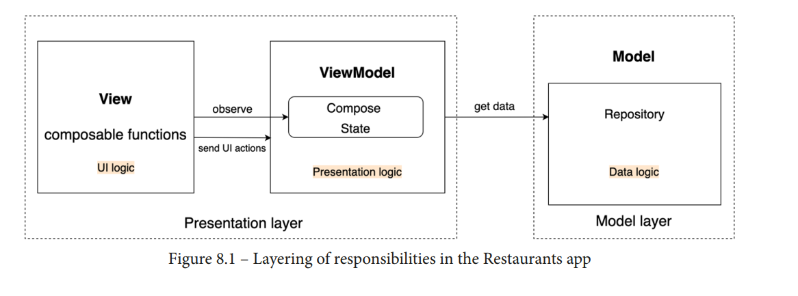
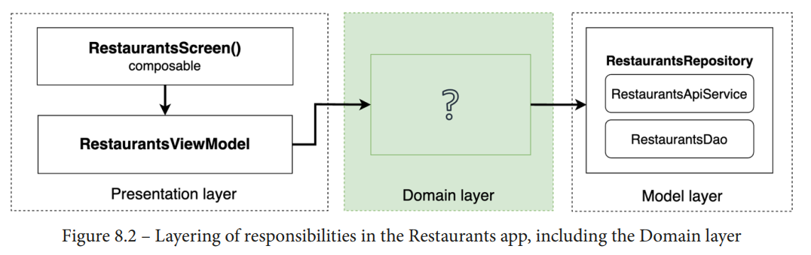
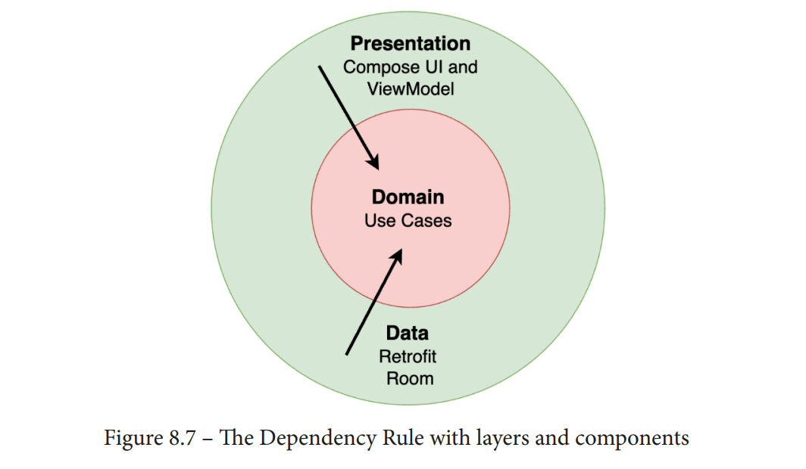

### **1.**Defining the Domain layer with Use Cases****

**With our existing layer structuring, we could sort the restaurants in the following:**
• **UI level (composables)**: Since this sorting logic is business logic, we should try to
avoid adding it here.
• **Inside the ViewModel**: If this sorting was a presentation option (so the user could
sort restaurants in different ways from the UI by selecting a picker or button),
we would have considered this to be presentation logic that can be held inside a
ViewModel **class; yet, remember that this rule is part of the business requirements,**
and the user shouldn't know about it, so it's probably not a good idea to implement
it here.
• **Inside the Repository**: Here, we store data logic (such as caching), which is
different from business logic.

> Not all applications, screens, or flows contain business logic. For these cases,
> the Domain layer is optional. The Domain layer should hold business logic,
> but, if there is no such logic, there should be no such layer.

### 2.Further reading

**Clean Architecture is a very complex subject, and one chapter is simply not enough to**
cover it. However, one of the most important concepts that Clean Architecture brings is
the Dependency Rule. The Dependency Rule states that within a project, dependencies
can only point inward.
To understand what the Dependency Rule is about, let's visualize the layer dependencies
of our Restaurants app through a simplified version of concentric circles. Each concentric
circle represents different areas of software with their corresponding layer dependencies
(and libraries).

**https://blog.cleancoder.com/uncle-bob/2012/08/13/the-cleanarchitecture.html**
