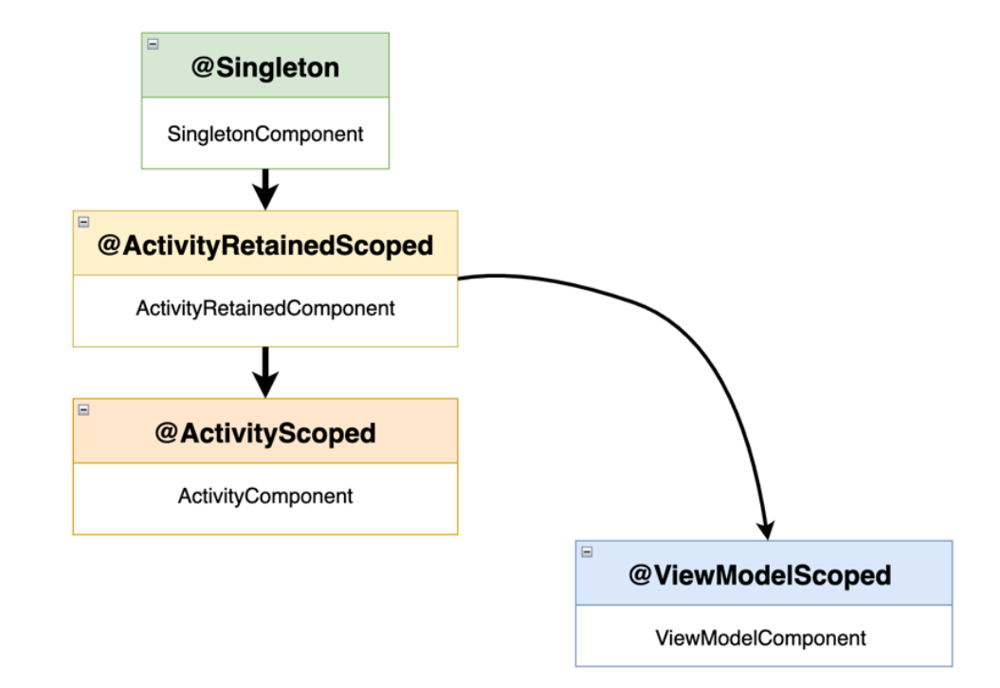

### 1.What is DI?

In simple terms, DI represents the concept of providing the instances of the dependencies
that a class needs, instead of having it construct them itself

> Apart from the DI technique, you can also use the **service locator** pattern to
> construct classes. Unlike DI, if you try to follow the service locator pattern,
> then the class that needs to be constructed will be responsible for creating its
> own dependencies with the help of a **ServiceLocator** component. Both
> DI and the service locator pattern are useful; however, we will only cover DI in
> this chapter.

### 2.Why is DI needed?

• Write less boilerplate code.
• Write testable classes.

### 3.Implementing DI with Hilt

> Hilt is a DI library based on another popular DI framework called Dagger,
> meaning that they are strongly related, so we will often refer to Hilt as Dagger
> Hilt in this chapter. Due to the steep learning curve of the Dagger APIs, Hilt
> was developed as an abstraction layer over Dagger to allow easier adoption of
> automated DI in Android projects

#### **Understanding the basics of Dagger Hilt**

* Injection
* Modules: are classes annotated with @Module that allow us to instruct Dagger Hilt on
  how to provide dependencies

  ```
  @Module
  object DataModule {
    @Provides
    fun provideRetrofit(): Retrofit {
      return Retrofit.Builder().baseUrl("some_url").build()
    }
  }
  ```
* Components: are interfaces that represent the container for a certain set of dependencies.
  A component takes in modules and makes sure that the injection of its dependencies
  happens with respect to a certain lifecycle

  ```
    @DefineComponent()
    interface MyCustomComponent(…) { /* component build code */ }

    @Module
    @InstallIn(MyCustomComponent::class)
    object DataModule {
      @Provides
      fun provideRetrofit(): Retrofit { […] }
    }
  ```



- **SingletonComponent**: Allows us to scope dependencies to the lifetime of the
  application, as singletons, by annotating them with the @Singleton annotation.
  Every time a dependency annotated with **@Singleton** is requested, Dagger will
  provide the same instance.
- **ActivityComponent**: Allows us to scope dependencies to the lifetime of
  an Activity, with the @ActivityScoped annotation. If the Activity is
  recreated, a new instance of the dependency will be provided.
- **ActivityRetainedComponent**: Allows us to scope dependencies to the
  lifetime of an Activity, surpassing its recreation upon orientation change, with
  the **@ActivityRetainedScoped** annotation. If the Activity is recreated
  upon orientation change, the same instance of the dependency is provided.
- **ViewModelComponent**: Allows us to scope dependencies to the lifetime of a
  ViewModel, with the **@ViewModelScoped** annotation

reference:

* https://dagger.dev/hilt/components.html
* https://medium.com/android-news/dagger-2-part-i-basic-principlesgraph-dependencies-scopes-3dfd032ccd82
* https://dagger.dev/hilt/components.html
* https://dagger.dev/hilt/android-entry-point
